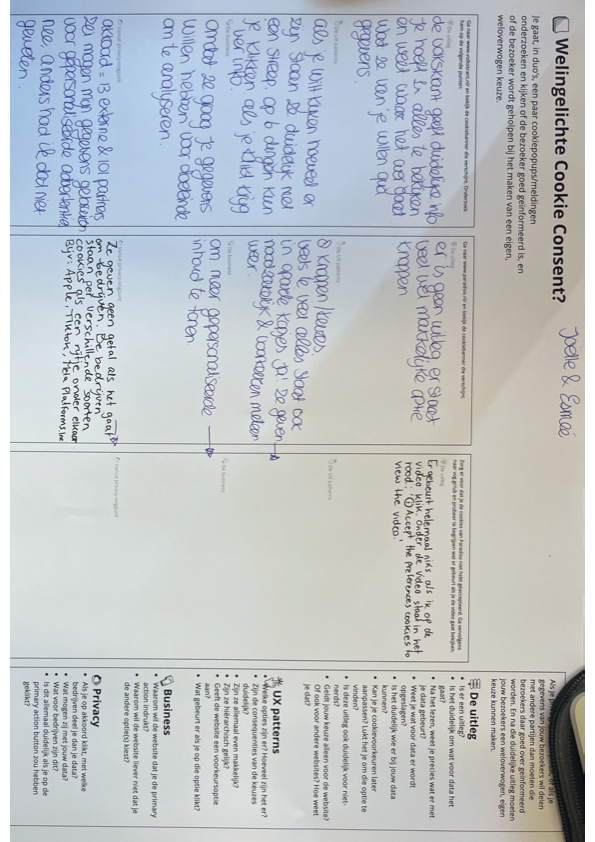

# Model

Het staat model voor digitale tuintjes welke bij 'Het web is voor iedereen' door studenten worden gemaakt.

### 31 aug - Kickoff

Een fork van de model repository gemaakt en gepubliceerd via mijn eigen Github omgeving.

## Check-out (Met Christina)
1. Een source hosting platform (broncodehostingsplatform) is een online platform waar ontwikkelaars de broncode van hun software opslaan, beheren en samen bewerken via versiebeheersystemen. Wij hadden keuze tussen Github en Codeberg, maar ik had vernomen dat Github makkelijker is en ik had daar al een account van dus ik heb gekozen voor Github.

2. Ik heb gekozen voor de domeinnaam Createmyidea.nl en ik heb dat gekoppeld door op Transit.nl mijn GitHub account te koppelen door het in te vullen bij 'waarde', daarna heb ik mijn domeinnaam ingevuld op GitHub.

3. Moet ik nog uitzoeken want ik heb nog geen aanpassingen aan mijn pagina gemaakt.
### [...]

[...]

### 3 sept - [Workshop] 
Ik heb 2 workshops gevolgd deze dag. Een over schetsen van Charley. We hebben geoefend met het maken van rechte lijnen en vierkanten.
Bij Diederik heb ik een workshop gevolgd over typografie. De workshop begon met de geschiedenis van typografie en daarna hebben we aan de hand van twee foto's van dolly Parton, lettertypes gezocht die bij haar passen. Dit deden we door woorden op te schrijven die passen bij de foto's en daarna woorden op te schrijven die passen bij die woorden.

[...]

### Sprint 1 maandag 7 september
We hebben in groepjes artikelen gelezen en daarna klassikaal besproken.
Ik heb 'A Brief History & Ethos of the Digital Garden' gelezen en daarna een korte samenvatting gemaakt zonder weer in het artikel te kijken tijdens het maken van de samenvatting.

Een digital garden is een plek op het web waar er veel ruimte is voor groei. Er wordt niet zo zeer gelet op wanneer iets is gepubliceerd als het wordt aanbevolen, er wordt meer gelet op de inhoud. Je ziet naast de datum dat het is gepubliceerd ook de datum waar er het laast aan is gewerkt. 
Een digital garden is een persoonlijke plek waar je alles zo persoonlijk en gek kan maken als je wil en deze is nooit klaar met groeien.

In groepjes hebben we websites bekeken en beoordeeld hoe 'webby' ze zijn. Wij hebben een formulier met criteria ingevuld. Daarna hebben we als groep de websites besproken en bepaald welke van deze websites het meest en minst webby is. Daar kwam uit:

-meest webby: Ericwbailey.website
-minst webby: Virtualvampirehaven.neocities.org

Ik ga nu verder met het huiswerk.
Dit betekent dat ik kijk naar welk onderwerp ik wil gebruiken voor mijn website en hoe ik wil dat het er ongeveer uit gaat zien.

**Check-out**
1. Een digital garden is een plek op het web waar er veel ruimte is voor groei. Er wordt niet zo zeer gelet op wanneer iets is gepubliceerd als het wordt aanbevolen, er wordt meer gelet op de inhoud. Je ziet naast de datum dat het is gepubliceerd ook de datum waar er het laast aan is gewerkt. 
Een digital garden is een persoonlijke plek waar je alles zo persoonlijk en gek kan maken als je wil en deze is nooit klaar met groeien.

2. Een website is webby als het fluïde, interactief, toegankelijk, volwassen, expressief en leuk/verassend is. Ik weet nu niet uit mijn hoofd welke websites me inspireren.

3. Ik wil in mijn website gebruik maken van animaties en ik vind een focus-state en hover state ook erg belangrijk. Ik ga van tevoren ook een kleurenpalet maken zodat het er aesthetic uit ziet.

### Sprint 1 woensdag 9 sept
Wij hadden online les.

We hebben kort in duo's gepresenteerd
Daarna hebben we inspo gezocht voor lettertypes. Ik heb posterss verzameld die er wel interessant uitzagen en ik heb geschetst.

### Maandag 14 sept
Check out met Ella:
Wanneer is een website lelijk?
Ik vind een website lelijk als content niet op schaal is. Als het te groot of te klein is.

De volgende stappen om mijn website responsive te maken zijn de afbeeldingen op een breed scherm naast elkaar te plaatsen en op een kleiner scherm onder elkaar.

Ik kan de bouw van mijn digital garden misschien wel uitleggen in 'Webby vocabulaire.'

### Week tot 18 sept
Ik heb veel gewerkt in illustrator en photoshop aangezien we alleen eigen content mogen gebruiken. Daarna heb ik deze ook aangepast om extra afbeeldingen te krijgen voor dark mode. Ik heb ook een hover toegevoegd bij de nav en ik heb een klikbare afbeelding naar mijn pinterest board gezet op mijn website.

### Check-out vrijdag 18 sept
Vragen en termen

-Waarom geven de docenten deze opdracht?
De docenten geven deze opdracht zodat we als ontwerpers weten wat er mogelijk is qua code. Het is ook handig als we met andere ontwerpers willen samenwerken.
-Welke technieken gebruik ik?
en van de belangrijkste leerdoelen van dit blok is het leren van HTML en CSS zodat je een betere digitale ontwerper wordt. Je kan er vanuit gaan dat HTML en CSS een belangrijke rol spelen in de opdracht.
-Wat zijn de randvoorwaarden?
Naast de gebruikte techniek zijn er eigenlijk altijd ook andere randvoorwaarden. Zorg er voor dat je die goed voor ogen hebt. Bijvoorbeeld: hoe veel tijd heb je? Wat is je kennis tot nu toe? Maar ook: is mijn ontwerp wel toegankelijk? voldoet het aan de privacy-wetgeving? En ook: is mijn ontwerp wel echt webby of maak ik een plaatje van een website?
-Waar gebruik je HTML/CSS voor?
Wees je bewust van de mogelijkheden en de onmogelijkheden van HTML en CSS. HTML is om content te structureren en om interactie mogelijk te maken. CSS is om vorm te geven, om dingen te verduidelijken, en om interactie prettiger te maken.
-Wat kan er allemaal met CSS?
Niemand weet wat er allemaal kan met CSS, er kan zoveel, steeds meer, en nog niet alles is ontdekt. Maar je kan wel een heel goed beeld krijgen van wat er allemaal ongeveer kan. Je kan op allerlei manieren dingen layouten, je kan eindeloze hoeveelheden visuele effecten toepassen, en je kan op talloze manieren dingen laten animeren. Je hoeft natuurlijk niet alles te kunnen, daar is dit blok veel te kort voor, maar het is wel lang genoeg om te zien wat er allemaal kan. Dan kan je kiezen wat je wil gaan leren, zowel tijdens het blok als daarna.

### Sprint 2 maandag 21 sept.
Vandaag hebben we gekeken naar bestaande cookie pop ups van website's. Bijvoorbeeld van de volkskrant. 

Na het bekijken van de websites hebben we een formulier ingevuld. en we hebben uitleg gekregen over de html structuur.

### Woensdag 23 sept
Ziek thuis gewerkt.
### Vrijdag 25 sept
ziek thuis gewerkt

### Maandag 28 sept:
-Wat bedoelt Vasilis met de uitspraak: Semantiek doet mij niet zo veel, ik ben liever bezig met de UX van HTML?
Hiermee bedoelt Vasilis dat hij minder waarde hecht aan de betekenis/structuur van HTML-elementen en vooral kijkt naar hoe HTML zich gedraagt en hoe prettig het voor de gebruiker werkt.

-Wat voor type beperkingen hebben invloed op het gebruiken van websites?
Visueel
Auditief
Motorisch
Cognitief

-Noem drie manieren om door een website te navigeren met jouw screenreader.
Er zijn shortcuts:
[control]+[option]+[U]	open lijst met headings, links, formelementen
↳ [←][→]	wissel tussen de lijsten
↳ [↓][↑]	op en neer in een lijst.

We hebben deze les gekeken naar hoe het is om een beperking te hebben. d.m.v brillen bijvoorbeeld waardoor je zicht minder goed is.

### Woensdag 30 sept:
ziek thuis gewerkt.

### Vrijdag 2 okt:
Vandaag hebben we voortgangsgesprekken.